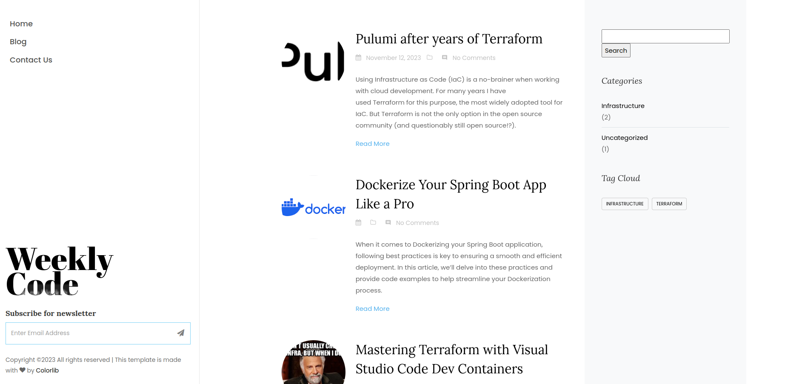

# Morpheus Matrix Wordpress Theme
Custom Wordpress Theme for a course at Plovdiv University "Paisii Hilendarski"


## Table of Contents

- [Installation](#installation)
- [Theme Features](#theme-features)
- [Plugins](#plugins)
- [Acknowledgements](#acknowledgements)

## Installation

1. Clone the repository to your WordPress themes directory:

    ```bash
    git clone https://github.com/your-username/your-theme.git wp-content/themes/your-theme
    ```

2. Activate the theme through the WordPress admin panel.

3. Customize the theme settings as needed.

## Theme Features

- Custom blog pages
- Two sidebars

## Plugins
### Yoast SEO

- **Description:** Yoast SEO is a comprehensive SEO plugin that helps optimize your content for search engines.
- **Link:** [Yoast SEO](https://wordpress.org/plugins/wordpress-seo/)

### Contact Form 7

- **Description:** Contact Form 7 is a widely used and customizable contact form plugin with support for multiple forms.
- **Link:** [Contact Form 7](https://wordpress.org/plugins/contact-form-7/)

### Reading Time WP
- **Description:** Adding an estimated reading time to your posts.
- **Link:** [Reading Time WP](https://jasonyingling.me/reading-time-wp/)

## Acknowledgements
The Wordpress theme is based on the following HTML theme: [Andrea – Free Bootstrap 4](https://themewagon.com/themes/free-bootstrap-4-html5-blog-website-template-andrea/)